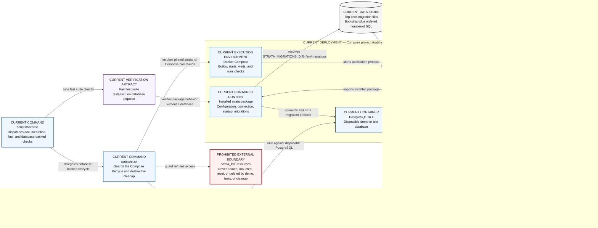

# Deployment and Verification Topology — current verification environment

This view maps the implemented repository entry points, runtime containers,
installed package, migration files, and test suites. It also shows the guarded
`strata_ci` deployment boundary and the explicit separation from live resources.

**Audience:** application, platform, database, and CI engineers reviewing how
the current baseline is built and verified.

## How to read this diagram

Read from the two command entry points on the left into the Compose boundary.
Tests are verification artifacts outside the product-runtime boundary; arrows
show when they are executed against or inside the disposable environment.

## Legend and notation

- `CURRENT CONTAINER` is a runnable container instance in the Compose
  deployment.
- `CURRENT CONTAINER CONTENT` is installed inside a container, not a separate
  deployable service.
- `VERIFICATION ARTIFACT` is test code, never a product runtime container.
- `CURRENT CONTROL` states a verified execution constraint rather than a
  deployable product container.
- `Current provider-free baseline` describes the implemented source tree; it
  does not claim a firewall or network-namespace control.
- `DATA STORE` identifies repository SQL or persistent database state.
- The dotted refusal arrow is a prohibited interaction, reinforced by text.

## Current versus target

All solid elements are current. Checked-in deterministic provider fixtures, data
ingestion, analytics workers, and the dashboard remain target MVP and are not
shown as current container instances. The `strata_live` label is only a safety
boundary; it is not a claim that a complete live deployment exists.

## Limitations and non-goals

This view omits Docker networking detail and individual test cases. It does not
model test code as a service, authorize direct volume deletion, or provide a
live operator procedure.

## Source traceability

| Diagram claim | Status | Source |
|---|---|---|
| `scripts/harness` is a thin test dispatcher | Current | `scripts/harness`, [repository layout](../repository-layout.md) |
| `scripts/ci.sh` owns guarded Compose lifecycle and cleanup | Current | `scripts/ci.sh`, [CI isolation](../../engineering/ci-isolation.md) |
| The image runs Python 3.12 and `python -m strata.main` | Current | `Dockerfile` |
| The container sets `STRATA_MIGRATIONS_DIR=/srv/migrations` | Current | `Dockerfile`, `src/strata/main.py` |
| Compose contains application and PostgreSQL services with project-prefixed storage | Current | `docker-compose.yml` |
| Fast tests and PostgreSQL integration tests are separate suites | Current | `tests/unit/`, `integration_tests/`, [testing guidance](../../engineering/testing.md) |
| Demo verification makes no external provider calls | Current boundary | [demo and live operations](../../operations/demo-and-live.md), current source tree |
| Demo and test cleanup must not access live resources | Current safety contract | [CI isolation](../../engineering/ci-isolation.md) |
