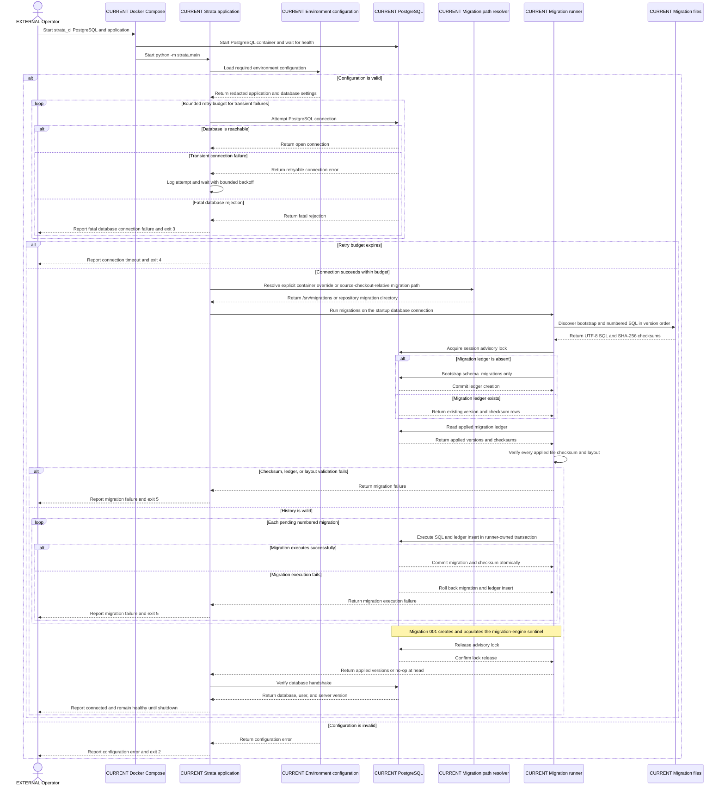

# UML Sequence — current startup and migration protocol

This sequence explains the implemented application startup path, including
bounded database retries, explicit migration bootstrap, checksum verification,
transactional migration execution, sentinel creation, and visible failures.

**Audience:** application, database, operations, and reliability engineers who
need to understand startup ordering and failure semantics.

## How to read this diagram

Time moves from top to bottom. Solid arrows are calls or writes; dashed arrows
are returns or reported outcomes. `loop` marks bounded retry behavior and `alt`
marks mutually exclusive success and failure paths.

## Legend and notation

- `CURRENT` participants are implemented.
- `EXTERNAL` identifies the operator outside the application boundary.
- `alt` is a conditional branch; `loop` repeats only within its named bound.
- SHA-256 is the Secure Hash Algorithm used to bind applied ledger rows to
  migration file bytes.
- A dashed return arrow communicates a result or failure; text, not color,
  identifies the outcome.

## Current versus target

The entire sequence is current. It ends at a healthy, idle migration baseline;
it does not continue into provider ingestion, parsing, analytics, publication,
or dashboard serving.

## Limitations and non-goals

This sequence compresses advisory-lock cleanup and SQL discovery validation for
readability. It is not a substitute for the exact exit handling, exception
types, or migration tests, and it does not address the documented wheel-runtime
migration-discovery limitation.

## Source traceability

| Diagram claim | Status | Source |
|---|---|---|
| Compose starts PostgreSQL before the application | Current | `docker-compose.yml` |
| Configuration errors exit visibly | Current | `src/strata/config.py`, `src/strata/main.py`, `tests/unit/test_config_and_retry.py` |
| Transient connections retry within a budget; fatal rejection and timeout differ | Current | `src/strata/db.py`, `integration_tests/postgres/test_connection.py` |
| Migration path uses an explicit container override or source-checkout-relative resolution | Current | `Dockerfile`, `src/strata/main.py`, [migration contract](../migrations.md) |
| Bootstrap creates only the ledger when absent | Current | `migrations/bootstrap.sql`, `src/strata/migrations.py`, `integration_tests/migrations/test_migrations.py` |
| Applied migrations are checksum-verified and pending migrations are transactional | Current | `src/strata/migrations.py`, [migration contract](../migrations.md) |
| Migration 001 creates and populates the sentinel | Current | `migrations/001_migration_sentinel.sql`, `scripts/ci.sh` |
| Startup reports connected and remains running | Current | `src/strata/main.py`, `scripts/ci.sh` |
