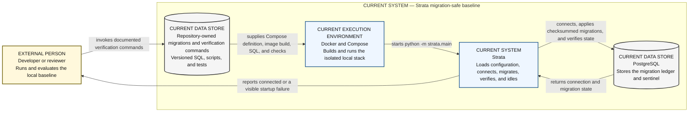

# C4 System Context — current implemented Strata baseline

This view explains the implemented Strata system as a migration-safe application
skeleton and local verification environment. It deliberately excludes the
target ingestion platform, analytics, and dashboard.

**Audience:** new engineers, reviewers, and technical interviewers who need a
fast, accurate boundary around what exists today.

## How to read this diagram

Read left to right from the external developer or reviewer. Each arrow names a
command, artifact, or result. Solid elements are implemented; the repository
artifact and PostgreSQL cylinder are data stores rather than running
applications.

## Legend and notation

- `CURRENT` means tracked implementation or configuration supports the element.
- `EXTERNAL PERSON` is outside the Strata system boundary.
- `DATA STORE` identifies persistent runtime or repository state.
- The enclosing boundary uses C4 System Context semantics; it is not a process
  or network boundary.
- Solid borders denote implemented elements. Status text remains authoritative
  in light and dark themes.

## Current versus target

Everything inside the system boundary is current. Ethereum and Aptos providers,
raw and staging layers, activity facts, analytics, publication gating, and a
dashboard are target MVP capabilities and therefore do not appear in this
current view.

## Limitations and non-goals

This diagram does not show function-level code, every test command, or every
failure mode. It is not a live deployment guide and makes no claim that provider
ingestion or empirical analysis exists.

## Source traceability

| Diagram claim | Status | Source |
|---|---|---|
| The application loads configuration, connects, migrates, reports connected, and idles | Current | `src/strata/main.py`, `src/strata/config.py`, `src/strata/db.py` |
| Compose starts PostgreSQL and the application | Current | `docker-compose.yml`, `Dockerfile` |
| Migrations are repository-owned, ordered, checksummed, and transactional | Current | `src/strata/migrations.py`, `migrations/`, [migration contract](../migrations.md) |
| Verification is repository-owned and guarded | Current | `scripts/harness`, `scripts/ci.sh`, [testing guidance](../../engineering/testing.md) |
| Ingestion, analytics, and dashboard are absent from current implementation | Current boundary | `src/strata/`, `migrations/`, [canonical PRD §7](../../Strata_PRD_v3.2_MASTER.md#7-architecture) |
