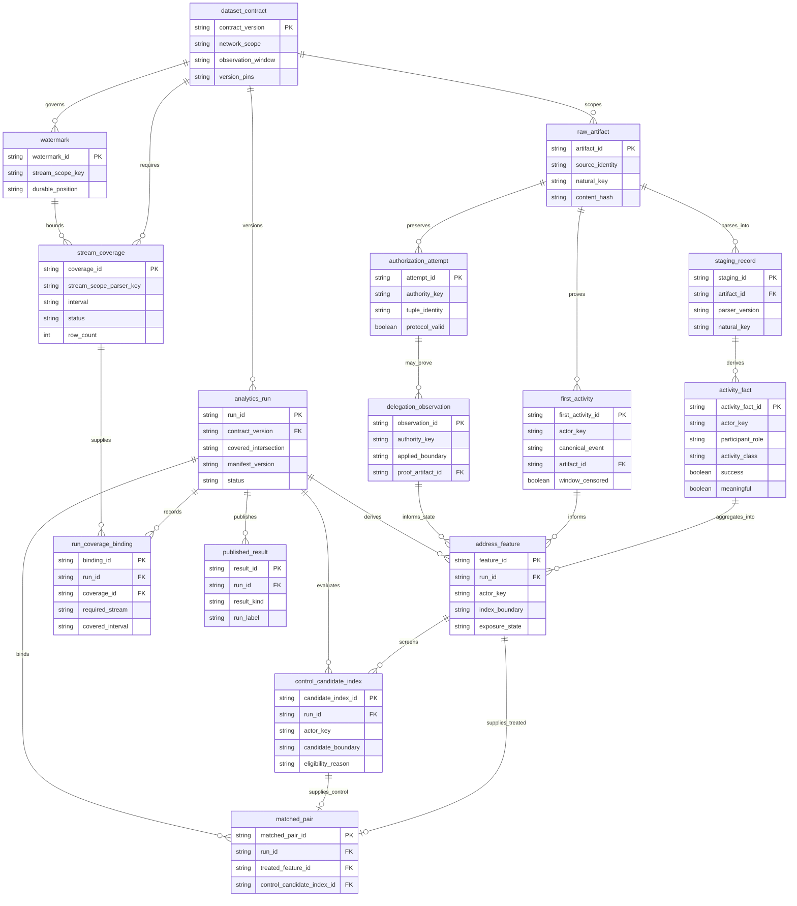

# Logical ER Diagram — TARGET MVP core data model

This selective logical model shows the major target entities that preserve
evidence, actor-safe derivation, coverage, matching, run lineage, and
publication. It intentionally omits most physical columns.

> **TARGET MVP — NOT FULLY IMPLEMENTED**

**Audience:** data engineers, analytics engineers, and methodology reviewers.

## How to read this diagram

Crow's-foot symbols show cardinality: `||` means exactly one, `o|` means zero or
one, and `o{` means zero or many. Every entity is a `TARGET DATA STORE` concept;
relationship labels name the logical dependency. Fields illustrate identity
and binding keys rather than a complete schema.

## Entity contract summary

| Concern | Logical rule |
|---|---|
| Identity keys | Raw, staging, facts, coverage, observations, features, pairs, runs, and results use stable natural or surrogate identities with the chain/scope/version context needed to prevent accidental collision. Ethereum and Aptos addresses retain chain-specific byte representations. |
| Append-only or versioned evidence | `raw_artifact`, `authorization_attempt`, `delegation_observation`, `stream_coverage`, and analytical manifests are append-only or explicitly versioned. Parser corrections create new `staging_record` versions rather than overwrite evidence. |
| Run-bound entities | `address_feature`, `control_candidate_index`, `matched_pair`, `run_coverage_binding`, and `published_result` bind to one `analytics_run` and its validated contract and manifest. |
| Coverage-bound publication | `run_coverage_binding` identifies the completed intervals used by a run, and `analytics_run` records their gap-free intersection. `published_result` exists only for an eligible published run; insufficient coverage yields an auditable refused run without partial results. |
| Attempt versus delegation | `authorization_attempt` records observed authorization evidence and validity separately. `delegation_observation` requires proof that delegation was applied; an attempt does not imply an applied delegation. |
| Actor versus payer or passive party | `activity_fact.actor_key` follows structural attribution. Bundlers, fee payers, sponsors, and passive recipients are never actors; payer and participant roles remain separate attributes. |

## Legend and notation

- Every entity is `TARGET / DATA STORE`; none is claimed as a current table.
- ER means entity-relationship. PK means primary key. FK means foreign key.
- Crow's-foot cardinality describes logical multiplicity, not a complete
  physical migration design.
- `eoa_7702_direct` is descriptive-only and never a matched arm.

## Current versus target

The whole logical model is target MVP. The current physical schema contains only
`schema_migrations` and `strata_migration_sentinel`, neither of which is part of
this selective study model.

## Limitations and non-goals

This is not migration SQL and does not settle column types, indexes, partitions,
or all natural-key components. It omits provider-specific raw and staging
subtypes, registry detail, exclusion lists, balance diagnostics, cohort cells,
manifest fields, and dashboard projections. Those require canonical PRD and
migration review when implementation is authorized.

## Source traceability

| Diagram claim | Status | Source |
|---|---|---|
| Dataset contract and version pins govern derived data and runs | Target | [canonical PRD §3](../../Strata_PRD_v3.2_MASTER.md#3-the-dataset-contract-v10), [study integrity](../../methodology/study-integrity.md) |
| Raw evidence, typed staging, actor-safe facts, and analytics form the lineage | Target | canonical PRD §7, [data pipeline](../data-pipeline.md) |
| Coverage and watermarks are stream-, scope-, interval-, and version-aware | Target | canonical PRD §7.1–§7.5, [coverage and publication](../coverage-and-publication.md) |
| First activity points to canonical retained evidence and may be window-censored | Target | canonical PRD §5.3, [temporal boundaries](../../methodology/temporal-boundaries.md) |
| Authorization attempts and applied delegation observations are distinct | Target | canonical PRD §7.1, [attribution invariants](../../methodology/attribution-invariants.md) |
| Control eligibility is evaluated at the candidate index boundary | Target | canonical PRD §5.5, [temporal boundaries](../../methodology/temporal-boundaries.md) |
| Matching is run-bound and publication is coverage- and manifest-bound | Target | canonical PRD §5.5 and §7.6, [coverage and publication](../coverage-and-publication.md) |
| Bundlers, fee payers, sponsors, and passive recipients are not actors | Target | [attribution invariants](../../methodology/attribution-invariants.md) |
