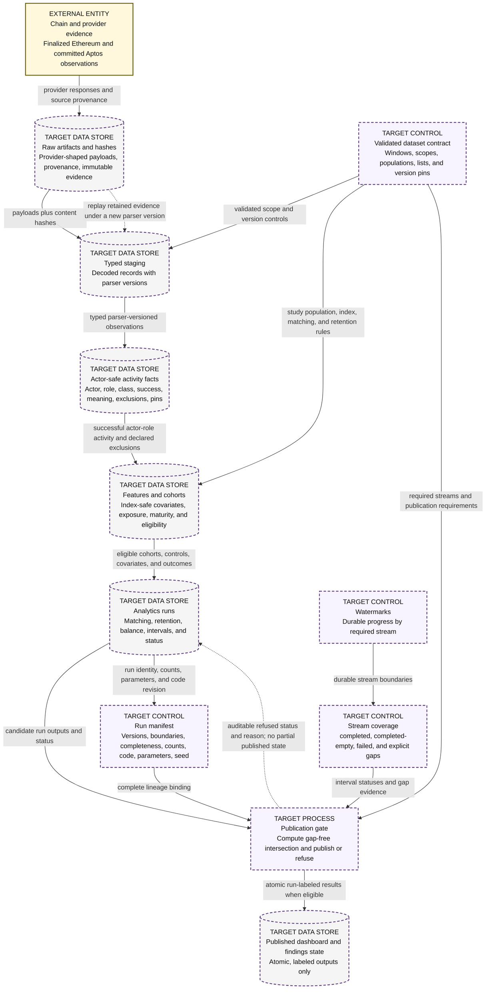
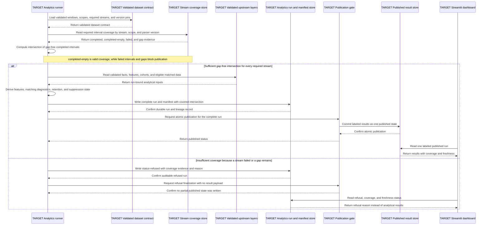

# Data Flow and Sequence — TARGET MVP lineage and publication

This file explains how target MVP evidence moves from external providers through
versioned layers into run-bound publication, and how incomplete coverage causes
an auditable refusal instead of partial results.

> **TARGET MVP — NOT FULLY IMPLEMENTED**

**Audience:** data-platform engineers, analytics engineers, methodology
reviewers, and reliability reviewers.

## How to read these diagrams

In the data-flow view, read the main evidence pipeline left to right and the
control inputs from top to bottom. The replay arrow returns retained raw
artifacts to parsing under a new parser version. In the sequence view, time
moves downward and the `alt` block separates publishable coverage from refusal.

## A. Target data-flow diagram

The main pipeline never credits a bundler, fee payer, sponsor, or passive
recipient as the actor. Authorization attempts and proven delegation
observations remain distinct evidence states. Exposure is assigned at the index
boundary, and analytical language remains associative rather than causal.

## B. Target publication sequence

## Legend and notation

- Every process and store in both diagrams is `TARGET`; dashed borders reinforce
  that it is not fully implemented.
- `EXTERNAL ENTITY` originates evidence outside Strata.
- `DATA STORE`, `CONTROL`, and `PROCESS` distinguish DFD roles.
- A dotted arrow denotes replay or a refusal feedback path, not weaker
  correctness.
- `completed-empty` means a successfully scanned interval with zero events.
- A run manifest binds outputs to declared data, code, versions, parameters,
  and coverage.

## Current versus target

Both diagrams are entirely target MVP. The current database contains only the
migration ledger and sentinel; none of the depicted evidence, fact, coverage,
analytics-run, manifest, or published-result stores is implemented.

## Limitations and non-goals

The DFD is logical rather than a physical table map and does not prescribe job
scheduling or message transport. The sequence compresses matching and
suppression calculations. Fixture evidence may verify this path but can never
produce empirical findings.

## Source traceability

| Diagram claim | Status | Source |
|---|---|---|
| Canonical lineage is raw to staging to facts to features/cohorts to analytics runs | Target | [canonical PRD §7](../../Strata_PRD_v3.2_MASTER.md#7-architecture), [data pipeline](../data-pipeline.md) |
| Raw evidence retains provenance and hashes; staging is parser-versioned | Target | canonical PRD §7, [data pipeline](../data-pipeline.md) |
| Decoder corrections replay retained raw artifacts under a new parser version | Target | [data pipeline](../data-pipeline.md) |
| Watermarks advance only after durable writes | Target | [data pipeline](../data-pipeline.md), canonical PRD §7.1–§7.2 |
| `completed-empty` is valid while failed intervals and gaps block publication | Target | [coverage and publication](../coverage-and-publication.md), canonical PRD §7.5 |
| Publication requires the gap-free intersection for every required stream | Target | [coverage and publication](../coverage-and-publication.md), canonical PRD §7.6 |
| Insufficient coverage records `status=refused` and no partial published state | Target | [coverage and publication](../coverage-and-publication.md) |
| Published charts are run-labeled and expose coverage and freshness | Target | canonical PRD §7.6–§7.7, [publication language](../../methodology/publication-language.md) |
| Actor and delegation evidence remain structurally separated | Target | [attribution invariants](../../methodology/attribution-invariants.md) |
