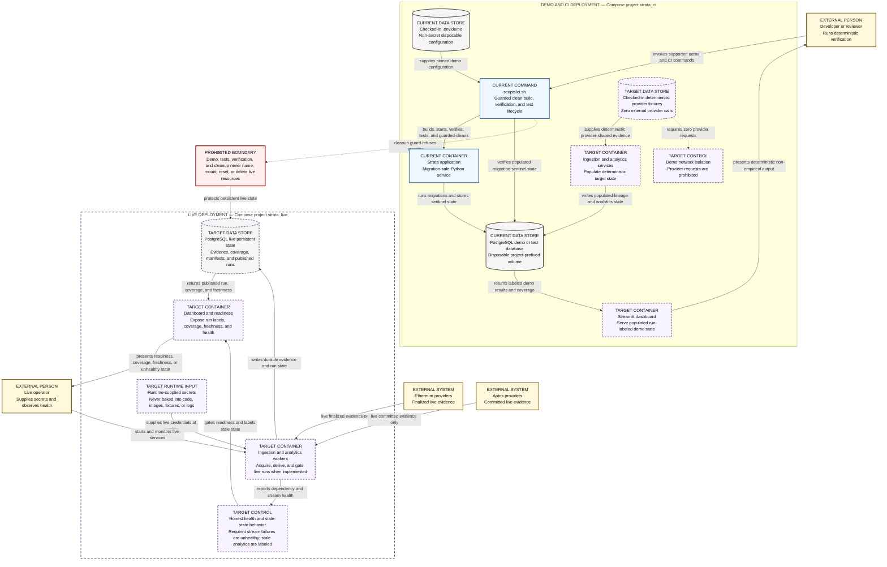

# C4 Deployment — TARGET MVP demo and live environments

This view separates the deterministic disposable demo/CI deployment from the
persistent live deployment and makes the live-resource safety boundary visible.
It also identifies which baseline elements exist now and which services remain
target MVP.

> **TARGET MVP — NOT FULLY IMPLEMENTED**

**Audience:** platform, operations, security, and reliability engineers.

## How to read this diagram

Read each environment independently from its operator entry point toward its
database and services. Solid `CURRENT` nodes exist in the baseline; dashed
`TARGET` nodes are specified but incomplete. The central prohibition is a
boundary, not a data flow: no demo, test, verification, or cleanup action may
cross it.

## Legend and notation

- `CURRENT` with a solid border is supported by tracked implementation or
  configuration.
- `TARGET` with a dashed border is required by the MVP but incomplete.
- `EXTERNAL` identifies people and provider systems outside Strata.
- `DATA STORE` is configuration, fixture, or PostgreSQL state.
- The dotted demo-isolation arrow marks a prohibited interaction, not a
  provider request.
- CI means continuous integration. MVP means minimum viable product.

## Current versus target

The `strata_ci` Compose identity, checked-in demo configuration, PostgreSQL
service, application skeleton, and guarded lifecycle are current. Deterministic
provider fixtures, a populated data platform, analytics, and dashboard are
target. The live deployment is a target boundary with established safety and
health contracts; a complete live operator procedure does not currently exist.

## Limitations and non-goals

This diagram does not authorize live operations, specify secret-distribution
technology, or claim that ingestion workers and dashboard are deployable today.
It omits container counts, scaling, and networking detail. Demo fixture output
is deterministic verification material, never empirical findings.

## Source traceability

| Diagram claim | Status | Source |
|---|---|---|
| Demo uses Compose project `strata_ci` and checked-in non-secret configuration | Current | `scripts/ci.sh`, `docker-compose.yml`, [demo and live operations](../../operations/demo-and-live.md) |
| Demo PostgreSQL state is disposable only behind the cleanup guard | Current | `scripts/ci.sh`, [CI isolation](../../engineering/ci-isolation.md) |
| Current application connects, migrates, verifies, and idles | Current | `src/strata/main.py`, `migrations/`, `scripts/ci.sh` |
| Target demo uses deterministic fixtures with zero external calls and populated output | Target | [canonical PRD §7.7](../../Strata_PRD_v3.2_MASTER.md#77-demo-and-live-modes-mvp), [testing guidance](../../engineering/testing.md) |
| Live credentials are runtime-supplied and failures surface as unhealthy | Target contract | [provider integration](../../engineering/provider-integration.md), [secrets and live data](../../engineering/secrets-and-live-data.md) |
| Live readiness depends on minimum coverage and stale analytics are labeled | Target | canonical PRD §7.7, [coverage and publication](../coverage-and-publication.md) |
| Demo and test cleanup never access `strata_live` resources | Current safety contract | [CI isolation](../../engineering/ci-isolation.md) |
| No complete live operator procedure exists today | Current boundary | [demo and live operations](../../operations/demo-and-live.md) |
