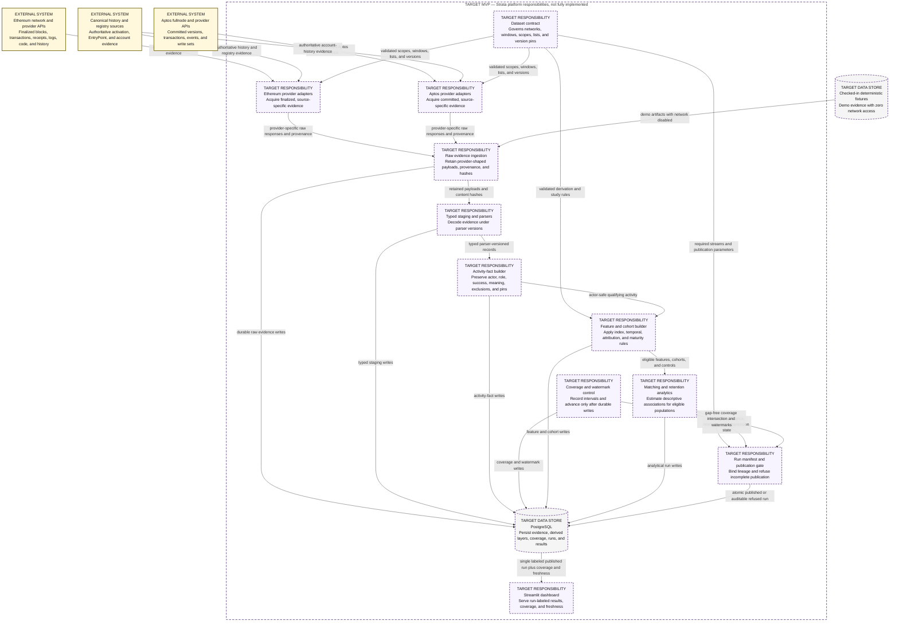

# Logical Responsibility Map — TARGET MVP platform, not fully implemented

This logical component view presents the approved MVP responsibilities for a
reproducible Ethereum and Aptos data platform and its observational
authentication-mode retention study.

> **TARGET MVP — NOT FULLY IMPLEMENTED**

**Audience:** data-platform engineers, methodology reviewers, and technical
interviewers evaluating the intended platform boundaries.

## How to read this diagram

Read live evidence from the external systems at the top and deterministic demo
evidence from the fixture store at the left. Both paths enter the same
lineage-preserving platform, but the live provider adapters remain
source-specific and are never silently interchangeable. Dashed borders and
`TARGET` labels identify capabilities that are not fully implemented.

## Legend and notation

- `TARGET` and dashed borders mean specified by the canonical PRD but not fully
  implemented.
- `EXTERNAL SYSTEM` is outside Strata and may have a different evidence
  universe.
- `DATA STORE` is persistent fixture or PostgreSQL state.
- This is a logical responsibility/component view, not a C4 Container diagram.
  A responsibility may later share a runnable worker with other
  responsibilities.
- MVP means minimum viable product. API means application programming
  interface.

## Current versus target

The complete diagram is a target view. The repository currently implements only
the configuration, PostgreSQL connection, migration runner, migration ledger,
sentinel, and verification baseline. The provider, lineage, analytics,
publication, and dashboard responsibilities shown here are not fully
implemented.

## Limitations and non-goals

This diagram does not prescribe process topology, queue technology, scaling, or
independent deployment for each responsibility. It excludes post-MVP chains,
alternative analytical stores, trace-backed application attribution, and other
roadmap capabilities. It reports an observational association architecture, not
a causal inference system.

## Source traceability

| Diagram claim | Status | Source |
|---|---|---|
| Dataset contract governs networks, windows, scopes, populations, and versions | Target | [canonical PRD §3](../../Strata_PRD_v3.2_MASTER.md#3-the-dataset-contract-v10), [study integrity](../../methodology/study-integrity.md) |
| Ethereum uses finalized evidence and Aptos uses committed versions | Target | [canonical PRD §7.1–§7.2](../../Strata_PRD_v3.2_MASTER.md#7-architecture), [data pipeline](../data-pipeline.md) |
| Provider adapters preserve source roles rather than silently substitute | Target | [provider integration](../../engineering/provider-integration.md), canonical PRD §5.3 |
| Raw, staging, fact, feature, and analytics layers preserve replay and lineage | Target | [canonical PRD §7](../../Strata_PRD_v3.2_MASTER.md#7-architecture), [data pipeline](../data-pipeline.md) |
| Coverage and manifests gate publication | Target | [canonical PRD §7.5–§7.6](../../Strata_PRD_v3.2_MASTER.md#75-coverage-as-intervals-mvp), [coverage and publication](../coverage-and-publication.md) |
| Demo fixtures make zero network calls; live dependencies report health honestly | Target | [canonical PRD §7.7](../../Strata_PRD_v3.2_MASTER.md#77-demo-and-live-modes-mvp), [demo and live operations](../../operations/demo-and-live.md) |
| PostgreSQL and Streamlit are the MVP storage and serving choices | Target | canonical PRD §6 F7 and §7.8 |
